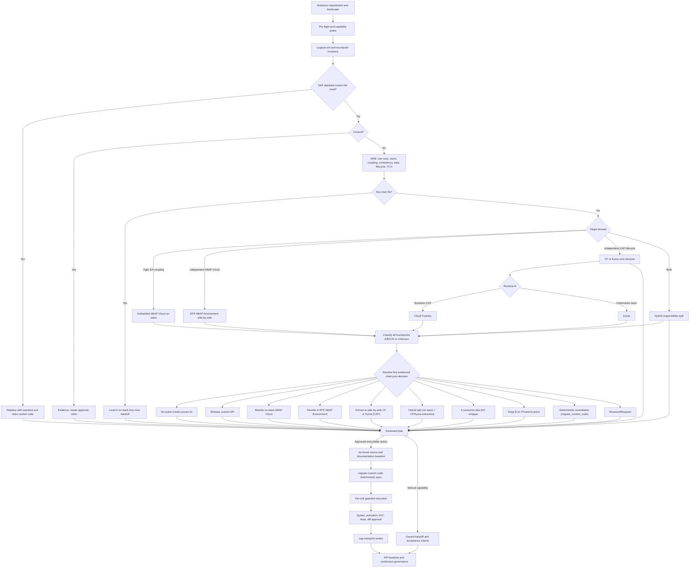
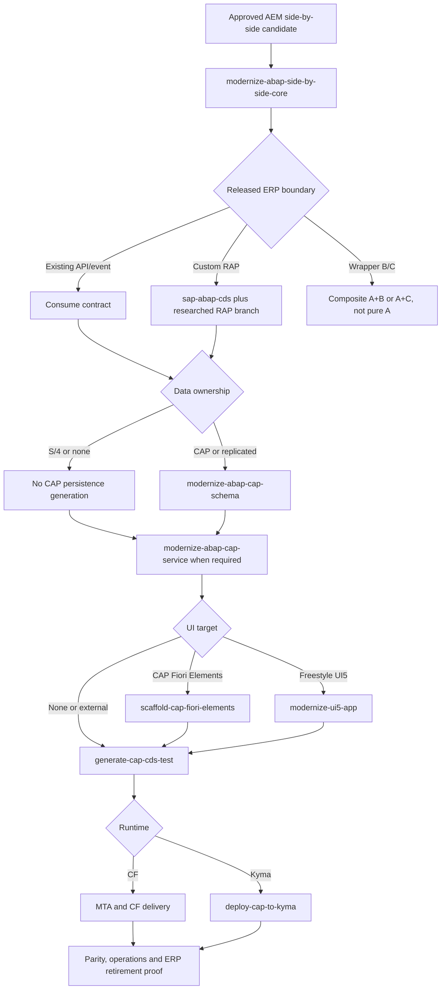
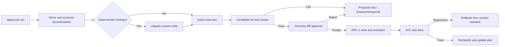
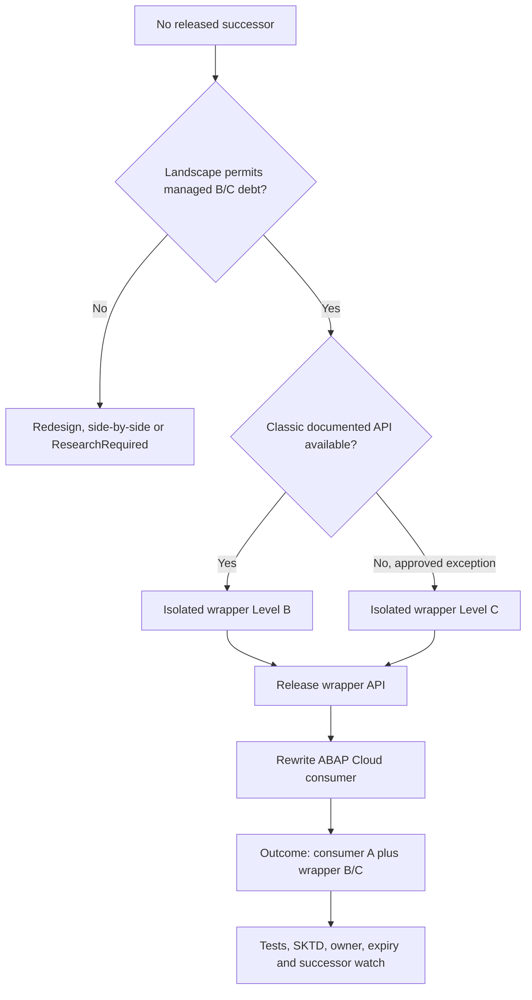

# Clean Core Refactor Workflow

This is the operator view of [`SKILL.md`](./SKILL.md). Decisions are defined in
[`DECISION_MATRIX.md`](./DECISION_MATRIX.md), machine routing in [`chain.json`](./chain.json), and
validated ARC-1 payloads in [`action-catalog.json`](./action-catalog.json). Start with
[`README.md`](./README.md) when onboarding.

## Operator quickstart

The examples in this section are skill invocations in an AI agent, not shell commands and not
ARC-1 CLI subcommands. In Codex, invoke `$sap-erp-clean-core-refactor`; in a namespaced Claude Code
plugin installation, use the equivalent `/arc-1:sap-erp-clean-core-refactor` command.

### 0. Confirm the two layers

ARC-1 provides the live SAP tools. The orchestrator is a separate skill that tells the agent how to
use those tools. If the skill is not already installed, install it once (requires an arc-1 npm
release that ships this skill; from a repository checkout use the local equivalent):

```bash
npx arc-1@latest skills install sap-erp-clean-core-refactor --agent codex --global
# from a checkout of this repository:
npm run build && node dist/cli.js skills install sap-erp-clean-core-refactor --agent codex --global
```

Start with ARC-1 read-only. Confirm that the connection works before requesting any plan or write.

### 1. Declare scope and business requirement

Prefer one package and its subpackages for the first pass. A single known object is also valid. Give
the business requirement when known; without it, standard parity and AEM decisions remain evidence
gaps rather than agent assumptions.

```text
Use $sap-erp-clean-core-refactor on package ZSD_CUSTOM in discover mode.
Landscape auto, domain auto, no SAP writes.
Business requirement: sales-order approval and operational reporting.
```

For one object:

```text
Use $sap-erp-clean-core-refactor on object CLAS ZCL_ORDER_APPROVAL in discover mode.
Landscape auto, domain auto, no SAP writes.
```

The discover result must identify the live landscape and release, ARC-1 capabilities, the system's
ATC check variants and default, package and transport constraints, logical units, touchpoints, owners
and missing evidence. Correct the scope or ownership before continuing.

### 2. Size the work without choosing targets

```text
Use $sap-erp-clean-core-refactor on ZSD_CUSTOM in estimate mode.
Reuse the accepted discovery evidence and remain read-only.
```

Review clusters, current A/B/C/D/Unknown evidence, unused candidates, effort ranges and confidence.
`Unknown` is an evidence gap, never an automatic D classification.

### 3. Produce the read-only plan

```text
Use $sap-erp-clean-core-refactor on ZSD_CUSTOM in plan mode.
Landscape s4-private-cloud, domain auto, report dossier, no SAP writes.
```

The plan must resolve standard-first and AEM before selecting a Clean Core action. Populate every
required fact in [`aem-model.json`](./aem-model.json); do not set `selectedDomain` as a substitute for
the questionnaire. For every logical unit, review the business owner, source level, derived target
domain, target level, exact action, operation IDs, evidence, confidence, gates, effort, rollback or
retirement path, target package and transport.

Run the deterministic resolver from the ARC-1 repository/package:

```bash
npm run --silent clean-core:resolve -- --facts docs/refactor/unit-facts.json
```

An independently installed skill contains the same entry point at `runtime/resolve-plan.mjs`. The
resolver is read-only: it returns the AEM record, decision, recursively expanded action plan,
skills, ARC-1 operation IDs, gate phases and pending MUST gates. Incomplete input, conflicting
on-stack/side-by-side signals, an incompatible runtime or a supplied domain that disagrees with AEM
returns `ResearchRequired`.

For `embedded_abap_cloud_on_stack` Level A, the plan must additionally prove all of the following:

- the target package/software component is approved for embedded ABAP Cloud development;
- `abapLanguageVersion="cloudDevelopment"` is confirmed from live object metadata when ARC-1 exposes it;
- every relevant SAP and custom touchpoint is released under a supported contract;
- the ABAP Cloud assessment variant passes.

ATC success alone is not proof of the object language version. If current ARC-1 metadata coverage
cannot prove the language version for an object type, attach verified ADT/package evidence manually.
Without that evidence, retain `research_required` and do not declare Level A.

For every side-by-side Level A target on BTP, the plan must prove:

- the exact existing API, custom RAP API or event crossing the ERP boundary;
- every relevant touchpoint is released and no direct S/4 database/unreleased access remains;
- `dataOwnership` with consistency controls — per target: `s4`, `btp_abap`, `replicated` or
  `none` for BTP ABAP Environment; `s4`, `cap`, `replicated` or `none` for CF/Kyma CAP
  (`btp_abap` ownership never pairs with a CAP runtime and vice versa);
- SAP and CAP transaction boundaries, retries, idempotency and compensation;
- authentication, principal propagation/technical identity and authorization ownership;
- independent lifecycle, support and ERP retirement or stable-boundary plan;
- why BTP ABAP Environment, CF or Kyma fits. CAP business applications prefer CF unless a concrete
  Kubernetes need is evidenced.

For `side_by_side_btp_abap`, the target ARC-1 connection must point to the BTP ABAP Environment and
the plan must prove its ABAP Cloud package, object language version and remote released ERP
boundary. Source-system operations and target-system writes remain explicitly separated. For CAP,
run `modernize-abap-side-by-side-core`, then select `cdsTarget`, `capServiceRequired`, exactly one
`uiTarget` and CF or Kyma. Missing facts remain `research_required`; BTP deployment is not
classification evidence.

### 4. Approve logical units explicitly

Approve decisions per logical unit, not for the package as a whole. Use the unit identifiers emitted
by the plan. A valid approval is concrete and records exclusions:

```text
Approve this plan subset:
- ORDER_APPROVAL: rewrite_on_stack_abap_cloud, target package ZSD_CC
- ORDER_LEGACY_API: create_or_use_wrapper, outcome A+B, wrapper package ZSD_CC_WRAPPERS
- ORDER_OLD_REPORT: remove_unused

Transport: DEVK900123
Keep ORDER_EXTERNAL_SYNC as research_required. Do not execute unlisted units.
```

Key User decisions approve a manual handoff, not an invented ARC-1 write. Kyma deployment approval
is separate from architecture approval and requires a real cluster, registry, namespace and
delivery owner. Wrapper approval must include owner, exception class, isolated package, successor
watch and retirement trigger.

### 5. Open only the required write ceiling

Configure ARC-1 outside the skill before execution. Scope writes to the approved packages. Enable
transport writes only when ARC-1 must create or release a transport; ordinary object writes still
require `SAP_ALLOW_WRITES`.

```text
SAP_ALLOW_WRITES=true
SAP_ALLOWED_PACKAGES=ZSD_CUSTOM,ZSD_CUSTOM/**,ZSD_CC,ZSD_CC/**,ZSD_CC_WRAPPERS,ZSD_CC_WRAPPERS/**
```

Only when ARC-1 must create or release a transport, also enable:

```text
SAP_ALLOW_TRANSPORT_WRITES=true
```

The server safety ceiling, authenticated user scope and native SAP authorization must all pass. Use
the approved existing transport or create one only after the package route and target are known.

### 6. Execute the approved subset

```text
Use $sap-erp-clean-core-refactor on ZSD_CUSTOM in execute mode.
Push only ORDER_APPROVAL and ORDER_LEGACY_API to A, using approved transport DEVK900123.
Stop after each logical unit for concrete diff approval.
```

Execution captures an as-found baseline, applies deterministic findings first, runs the selected
architecture action, checks candidate syntax, presents the concrete diff for approval, writes
through ARC-1 only after that approval, activates, runs ATC and tests, and reclassifies the
accepted unit. A failed gate stops that unit and does not authorize work on the next one.
Deterministic SAP quick fixes are the one exception: their batch shares one explicit
package/transport approval instead of per-diff approval (PATTERNS §10).

### 7. Review transport and govern

Run `sap-transport-review` before any release. Transport release remains a separate explicit
approval. After accepted execution, request governance:

```text
Use $sap-erp-clean-core-refactor on ZSD_CUSTOM in govern mode.
Report KPI deltas, ATC regression, wrapper successors, exception expiry and the next review backlog.
```

The durable output is the reviewed plan plus execution evidence, not the chat transcript. Keep the
plan under `docs/refactor/<date>-clean-core-plan.md` and update it after every accepted unit.

## End-to-end flow



## Five operator movements

| Movement | Command | Main outputs | Writes |
|---|---|---|---|
| Understand | `sap-erp-clean-core-refactor ZPKG discover` | system context, capabilities, inventory, touchpoints | No |
| Size | `sap-erp-clean-core-refactor ZPKG estimate` | clusters, current levels, effort range, evidence gaps | No |
| Decide | `sap-erp-clean-core-refactor ZPKG plan` | AEM records, decision rows, operation IDs, approvals | No |
| Execute | `sap-erp-clean-core-refactor ZPKG execute` | accepted changes, validation evidence, handoffs | Yes, approved branches only |
| Govern | `sap-erp-clean-core-refactor ZPKG govern` | KPIs, regression, wrapper/exemption lifecycle | No by default |

These compact forms describe the mode contract; invoke them through the agent syntax shown in the
operator quickstart.

The human plan gate sits between Decide and Execute. No write-capable delegate may run before it.
For side-by-side actions, `chain.json.gatePhases` separates plan, build, accept and retire gates;
parity, CAP verification and retirement proof are outcomes of later phases, not circular build
prerequisites.

## Plan sequence

1. `bootstrap-system-context` captures release, system type, components and ADT capabilities;
   operation `atc_variants` confirms which check variants and default this system really has.
2. `sap-transport-overview` identifies open-request conflicts.
3. ARC-1 inventory operations collect package contents and exact object metadata.
4. The orchestrator clusters compilation/logical units and maps extension touchpoints.
5. `sap-unused-code` supplies removal evidence where SQL/runtime data is available.
6. `sap-clean-core-atc` classifies current evidence without treating unknown as D.
7. `explain-abap-code` documents intent for every non-trivial non-A unit.
8. The local curated knowledge index supplies bounded rules and page provenance.
9. `aem-model.json` derives the target domain and records matched signals or blocking conflicts.
10. Live SAP release state and official documentation confirm the specific successor or extension
   point.
11. The decision matrix selects an action and the runtime resolver expands every nested dispatch.
    The output is editable and read-only.

## Side-by-side Level A sequence



ABAP CDS and CAP CDS may both appear only for `cdsTarget=dual_boundary`: ABAP CDS/RAP exposes the
released S/4 boundary; CAP CDS models CAP-owned or replicated state. They never model the same
ownership accidentally.

## Execution sequence



Deterministic SAP quick fixes may reuse one explicit approval scoped to package and transport. They
still pass syntax, activation, ATC and tests. Mechanical transformations without an SAP proposal,
and every generated redesign, require concrete diff approval.

## Action routing

| Action | Primary executor | Important boundary |
|---|---|---|
| `replace_with_standard` | Human/SAP configuration plus ARC-1 retirement | Parity approval before deletion |
| `replace_with_key_user_extensibility` | Key User owner, manual SAP app handoff | ARC-1 provides evidence; it does not automate key-user apps |
| `rewrite_on_stack_abap_cloud` | ARC-1 plus ABAP/RAP skills | Level A can remain embedded in S/4HANA |
| `rewrite_side_by_side_btp_abap` | Source ARC-1 evidence plus a distinct target ARC-1 connection | BTP ABAP Environment is side-by-side; target package/language and remote released boundary are mandatory |
| `release_api` | ARC-1 | Use the live supported contract, then reclassify consumers |
| `create_or_use_wrapper` | ARC-1 plus human exception governance | Wrapper package/component is separate; report composite level |
| `extract_to_side_by_side_cf` | Common side-by-side contract, conditional CAP/CDS/UI/test chain, CF packaging | Old ERP code retires only after parity and operations proof |
| `extract_to_side_by_side_kyma` | Same common CAP chain plus official CAP Kyma/Helm workflow | Requires a concrete Kubernetes need and cluster/registry delivery approval |
| `hybrid_extension` | Composite on-stack and CF/Kyma executors (`sideBySideRuntime` picks the extraction) | Record responsibility and transaction boundaries |
| `no_action` | Documentation only | Retain proven Level A; governance baseline still records it |
| `migrate_custom_code` | ARC-1 deterministic quick-fix loop | One explicit package/transport approval; syntax, activation, ATC, tests remain mandatory |
| `keep_at_level_b` | Documentation/governance | Private/on-prem only; Level B needs no informational ATC exemption |
| `remove_unused` | ARC-1 after evidence and owner approval | Final references check immediately before delete |
| `research_required` | Read-only research | Never converted to D without evidence |

## Wrapper workflow



Never place the wrapper in the ABAP Cloud software component. Do not wrap SAP GUI technology,
uncontrolled commits/rollbacks or an API whose semantics cannot be stabilized.

## Governance loop

| Control | Frequency | Output |
|---|---|---|
| ATC assessment | Per plan and after every unit | current classification and regression delta |
| Development/transport ATC gate | Every changed transport | blocking P1/P2 findings under governed variant |
| Wrapper successor watch | Every SAP upgrade/release review | replace/retain decision and retirement date |
| Exception expiry | Monthly or release cycle | renew, remediate or close |
| Unused-code refresh | Quarterly | removal candidates and Unused Code Share |
| KPI review | Release or quarterly | Clean Core Share, Technical Debt Score, Unused Code Share, Business Modifications |

## Acceptance checklist

- The plan records business need, landscape, target domain and source evidence.
- The selected action exists in `chain.json` and all operation IDs exist in `action-catalog.json`.
- Manual Key User branches contain owner, implementation app/tool and acceptance criteria.
- Every write is inside ARC-1 package, transport and authorization gates.
- Every generated diff has explicit approval.
- Every changed unit has syntax, activation, ATC and applicable test evidence.
- Every `embedded_abap_cloud_on_stack` Level A unit proves its ABAP Cloud target package, object language
  version and released touchpoints; missing metadata blocks the A classification.
- Every `side_by_side_btp_abap` unit proves a distinct target connection, ABAP Cloud target package,
  object language version, released remote ERP boundary and side-by-side lifecycle evidence.
- Every side-by-side Level A unit has the complete side-by-side decision contract. Schema, service,
  UI and runtime skills match its facts; no unresolved `501`/migration TODO remains.
- `dataOwnership=s4|none` never dispatches `modernize-abap-cap-schema`; CAP Fiori Elements and
  freestyle UI5 are never dispatched together.
- Composite wrapper debt and retirement triggers remain visible in governance output.
- `sap-transport-review` passes before release.
