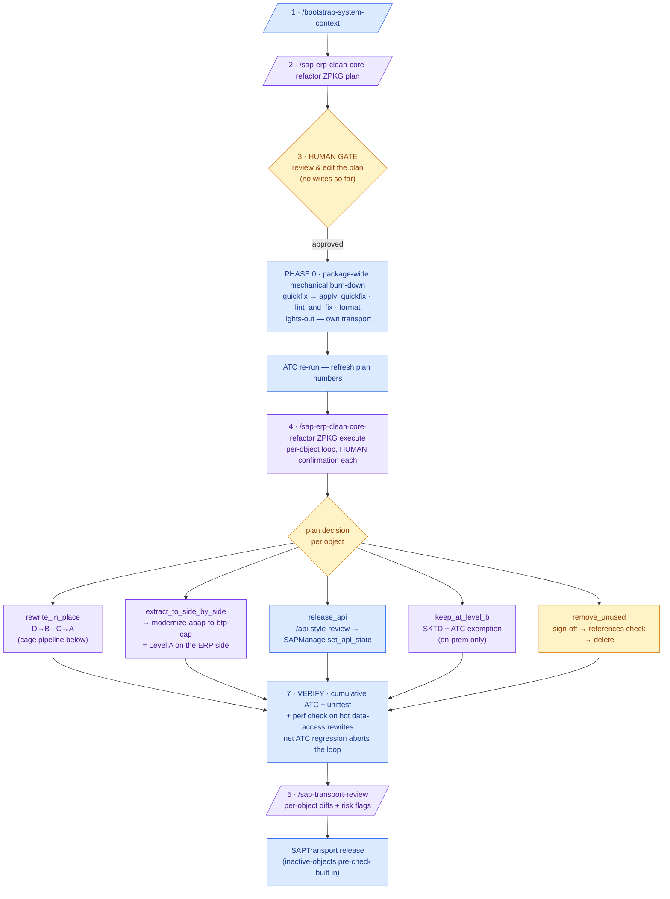
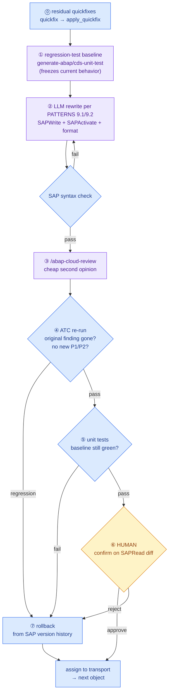

# Clean Core Refactor — Operator's Guide

The end-to-end sequence for taking one custom package (`Z*`/`Y*`) from "unknown custom code"
to "classified, remediated, and refactored toward Clean Core Level B/A" — showing **exactly
which skill runs at each step, where it comes from, what it delegates to, and how automated
each step really is**.

You type **five things**. Everything else is delegation.

## Legend 1 — where does each piece come from?

| Origin | Meaning |
|---|---|
| **CHAIN** | Ships with this skill set (`sap-erp-clean-core-refactor` + the `modernize-abap-cap-*` chain) |
| **arc-1** | Stock ARC-1 skill — present in the upstream `skills/` catalog |
| **PLUGIN** | External agent plugin (e.g. [secondsky/sap-skills](https://github.com/secondsky/sap-skills)) — review/gate commands only, never writes |
| **MCP** | An MCP server, not a skill. **ARC-1 is the only thing that ever writes to the SAP system** |

Division of labor: **skills decide, plugins review, ARC-1 executes.**

## Legend 2 — automation tiers: who actually produces the result?

There is no "refactor this to clean core" API in SAP ADT. ARC-1 reads, writes, activates and
checks — **the new ABAP code is written by the LLM agent running this skill**, inside a cage of
deterministic gates. Every step below is tagged with one of three tiers:

| Tier | What it means | Who decides the output | Reliability model |
|---|---|---|---|
| **Deterministic** 🟦 | SAP-proposed quickfixes (`SAPDiagnose quickfix → apply_quickfix`), `SAPLint lint_and_fix`/`format`, ATC/unit-test runs, reads, transport ops | SAP / abaplint / the tool — zero LLM creativity | High: exact transformations and hard pass/fail gates |
| **Generative** 🟪 | The actual rewrites (D→B, C→A), test generation, CAP scaffolds, reviews, reports — the agent reads the source, consults [`PATTERNS.md`](./PATTERNS.md) recipes + plugin knowledge, and writes the result | The LLM agent | Only as good as the gates around it — never trusted bare (see the cage below) |
| **Human** 🟨 | Plan review/edit, per-object confirmation on the diff, `remove_unused` sign-off, side-by-side QA parity | You | — |

The mechanical (Deterministic) pass runs **twice by design**: once package-wide as **Phase 0**
right after plan approval (lights-out — the only part that needs no per-object review), and
again per object as step ⓪ of every rewrite, catching mechanical findings that surface during
the rewrite itself.

## The process at a glance

🟦 Deterministic · 🟪 Generative · 🟨 Human — numbers refer to table A.

**The cage around every Generative rewrite** (one object inside `rewrite_in_place`):

## Prerequisites (server-side, once)

| Config | Why |
|---|---|
| `SAP_ALLOW_WRITES=true` + `SAP_ALLOWED_PACKAGES=ZPKG/**` | every mutation (incl. activation) is checked fail-closed against the object's real package |
| `SAP_ALLOW_TRANSPORT_WRITES=true` | create/reassign transport requests in Phase 5 |
| `SAP_ALLOW_FREE_SQL=true` *(optional)* | only for runtime dead-code detection (SCMON/SUSG) |
| **Transportable package — not `$TMP`** | ATC silently skips local objects: 0 findings on a `$TMP` package means "not checked", not "clean" |

> **Honesty note on "automatic ATC remediation":** the automatic pass covers *mechanical*
> findings (Deterministic tier — Phase 0 plus the per-object residue step). Architectural
> findings — unreleased APIs, direct DB access, modifications — have no auto-fix by
> definition; they become plan decisions executed at the Generative tier under the cage above.

## A — What you type (5 steps)

| # | You type | Skill | Origin | Tier | What happens |
|---|---|---|---|---|---|
| 1 | `/bootstrap-system-context` | `bootstrap-system-context` | **arc-1** | Deterministic | `SAPManage(action="probe")` → SID, release, components, features; formatter + ATC preset; `abap_feature_matrix` snapshot → `system-info.md`. No sub-skills |
| 2 | `/sap-erp-clean-core-refactor ZPKG plan` | `sap-erp-clean-core-refactor` | **CHAIN** | Generative (analysis — **no writes**) over Deterministic evidence | Inventory → classification → per-object decision → editable plan at `docs/refactor/<date>-clean-core-plan.md`. Delegation: table B |
| 3 | *(review & edit the plan — no command)* | — | — | **Human** | The gate. Override any per-object decision before anything touches the system |
| 4 | `/sap-erp-clean-core-refactor ZPKG execute` | `sap-erp-clean-core-refactor` | **CHAIN** | **Phase 0**: Deterministic, lights-out · then per-object loop: mixed tiers (table C) with **Human** confirmation throughout | Package-wide mechanical burn-down + ATC refresh first, then applies the plan object by object. Delegation: table C |
| 5 | `/sap-transport-review` | `sap-transport-review` | **arc-1** | Generative review over Deterministic diffs | Pre-release gate: per-object unified diffs + risk flags on the transport. Standalone |

## B — Delegation chain of `plan` (step 2)

| Internal step | Calls | Origin | Tier |
|---|---|---|---|
| 1e Bootstrap (if step 1 wasn't run) | `bootstrap-system-context` | **arc-1** | Deterministic |
| 1f Transport-conflict scan | `sap-transport-overview` — objects locked in someone else's open TR would stall Phase 5 | **arc-1** | Deterministic |
| 2 Inventory | `SAPRead(type="DEVC")` recursive, `SAPSearch(searchType="tadir_lookup")`, red-flag `grep` pre-scan | **MCP** ARC-1 | Deterministic |
| 2e Impact | `SAPContext(action="impact")` per candidate — fan-in drives the risk × effort multipliers | **MCP** ARC-1 | Deterministic (data); multiplier table is mechanical |
| 2d Dead code (optional) | `sap-unused-code` — needs `SAP_ALLOW_FREE_SQL` | **arc-1** | Deterministic (SCMON/SUSG evidence) |
| 3 Classification A–D | `sap-clean-core-atc` → `SAPDiagnose(action="atc")` + `sap_get_object_details` per SAP reference; worst-level roll-up | **arc-1** + **MCP** sap-docs | Deterministic (ATC findings + dataset lookup + mechanical roll-up) |
| 4 JIT evidence lookup | `mcp-sap-docs` (`sap_community_search`, `sap_discovery_center_search`, `abap_feature_matrix`), `@sap/cds-mcp`, `context7` | **MCP** | Deterministic retrieval, Generative synthesis |
| 4 Budget-exhausted fallback | `explain-abap-code` — stubborn objects only | **arc-1** | Generative |
| 4 Per-object decision | decision tree + [`PATTERNS.md`](./PATTERNS.md) Category 9 recipes | **CHAIN** (reference doc) | Generative (proposal — finalized by the **Human** gate, step 3 of table A) |
| 5 Stakeholder report (`--report=dossier`) | `sap-migration-dossier` | **arc-1** | Generative (report writing) |

## C — Delegation chain of `execute` (step 4)

**Phase 0 comes first, package-wide, then the per-object loop.**

| Plan decision | Calls | Origin | Tier |
|---|---|---|---|
| **Phase 0 — mechanical burn-down** (all rewrite/mechanical objects, one sweep) | `SAPDiagnose(action="quickfix")` → `apply_quickfix` + `SAPLint(action="lint_and_fix")` + `SAPLint(action="format")`; own transport; `SAPDiagnose(action="atc")` re-run refreshes the plan numbers | **MCP** ARC-1 | **Deterministic — lights-out** (no per-object review; ATC + unit tests are the net) |
| *(before the loop)* optional local baseline | `setup-abap-mirror` — abapGit-style package snapshot for local `git diff` evidence | **arc-1** | Deterministic |
| **`rewrite_in_place`** (D→B, C→A) | ⓪ residual quickfixes surfaced during rewrite: `quickfix` → `apply_quickfix` | **MCP** ARC-1 | Deterministic |
| | ① regression tests: `generate-abap-unit-test` / `generate-cds-unit-test` (CDS seeds from `SAPDiagnose(action="cds_testcases")` on 8.16+) | **arc-1** | Generative (test code) over Deterministic seeds |
| | ② rewrite per [`PATTERNS.md`](./PATTERNS.md) 9.1/9.2 recipes → `SAPWrite` + `SAPActivate` + `SAPLint(action="format")` | **CHAIN** + **MCP** ARC-1 | **Generative** — the LLM writes the ABAP; syntax check + format are Deterministic |
| | ③ `/abap-cloud-review` — cheap review BEFORE the ATC round-trip | **PLUGIN** `sap-abap` | Generative (review) |
| | ④⑤⑥ `SAPDiagnose(action="atc")` + `unittest` + `SAPRead(action="diff")`; ⑦ rollback from version history on regression | **MCP** ARC-1 | Deterministic gates + **Human** confirmation on the diff |
| | RAP behavior logic → `generate-rap-logic`; full RAP stack (rare) → `generate-rap-service-researched` | **arc-1** | Generative |
| **`rewrite_in_place`** — specialized shapes | SEGW V2 service (MPC/DPC) → `migrate-segw-to-rap` (never hand-rewrite generated classes) | **arc-1** | Generative (guided reverse-engineering) |
| | analytical Z report → `generate-analytics-star-schema` → `generate-cds-analytical-query` | **arc-1** | Generative |
| | only mechanical findings on the object → `migrate-custom-code` standalone | **arc-1** | Deterministic core + Generative residue |
| **`extract_to_side_by_side`** (= Level A on the ERP side) | `modernize-abap-to-btp-cap` orchestrator, which chains: | **CHAIN** | Generative scaffold, Deterministic compile/validate gates |
| | ├ `modernize-abap-cap-schema` (`db/schema.cds` from Z tables) | **CHAIN** | Generative (mapping table-driven) + Deterministic `cds compile` gate |
| | ├ `modernize-abap-cap-service` (`srv/service.cds` + handler stubs) | **CHAIN** | Generative |
| | ├ `/api-style-review` on the generated service surface | **PLUGIN** `sap-api-style` | Generative (review) |
| | ├ UI: `convert-ui5-to-fiori-elements` (annotation-driven LROP) **or** `modernize-ui5-app` (freestyle TS) | **arc-1** | Generative |
| | ├ `/ui5-linter-check` → `/ui5-linter-fix-plan` | **PLUGIN** `sapui5-linter` | Deterministic lint + Generative fix plan |
| | ├ hand-off gates: `/cap-deployment-checklist` + `/btp-app-readiness-review` (+ `/btp-architecture-review` for larger landscapes) | **PLUGIN** `sap-cap-capire`, `sap-btp-developer-guide`, `sap-btp-best-practices` | Generative (review) |
| | └ destination triage: `/btp-destination-diagnose` | **PLUGIN** `sap-btp-connectivity` | Generative (diagnosis) |
| | QA parity before the ABAP original is retired | — | **Human** |
| **`release_api`** (B→A closing move) | stability check (`SAPContext` fan-in + owner sign-off) → `/api-style-review` → `SAPManage(action="set_api_state", contract="C1")` | **PLUGIN** + **MCP** ARC-1 | **Human** sign-off → Generative review → Deterministic PUT |
| **`keep_at_level_b`** (on-prem only) | `sap-object-documenter` — SKTD rationale + ATC exemption | **arc-1** | Generative (documentation) |
| **`remove_unused`** | sign-off → `SAPNavigate(action="references")` last check → `SAPWrite(action="delete")` | **MCP** ARC-1 | **Human** sign-off → Deterministic check + delete |
| Transport handling (per phase/cluster) | `SAPTransport(action="check")` → `create` → `reassign`; ARC-1 pre-checks inactive objects before `release` | **MCP** ARC-1 | Deterministic |

## D — Verification (inside step 4, then step 5)

| Check | Calls | Origin | Tier |
|---|---|---|---|
| Cumulative ATC + unit tests on the whole package (net ATC regression **aborts the loop**) | `SAPDiagnose(action="atc")` + `SAPDiagnose(action="unittest")` | **MCP** ARC-1 | Deterministic |
| Perf regression on hot data-access rewrites (a released `I_*` view can be slower than the SELECT it replaced) | `debug-slow-sql` ladder (`odata_perf` / `cds_sql`) | **arc-1** | Deterministic measurements, Generative interpretation |
| Pre-release transport gate | `sap-transport-review` (step 5 of table A) | **arc-1** | Generative review over Deterministic diffs |
| Session learnings (optional) | `analyze-chat-session` | **arc-1** | Generative |

## The full census

- **You invoke 5 things**; 3 are stock arc-1, 2 are this chain's orchestrator.
- **This chain owns exactly 4 skills**: the orchestrator + the 3 CAP-extraction skills. Everything else it drives is stock arc-1 (**21 upstream skills** engaged across the run: bootstrap-system-context, sap-transport-overview, sap-unused-code, sap-clean-core-atc, explain-abap-code, sap-migration-dossier, setup-abap-mirror, generate-abap-unit-test, generate-cds-unit-test, generate-rap-logic, generate-rap-service-researched, migrate-segw-to-rap, generate-analytics-star-schema, generate-cds-analytical-query, migrate-custom-code, convert-ui5-to-fiori-elements, modernize-ui5-app, sap-object-documenter, debug-slow-sql, sap-transport-review, analyze-chat-session) or external plugins (**7 review/gate commands**, never writes).
- **Every write to the SAP system goes through the ARC-1 MCP server** — behind its safety ceiling (`allowWrites`, package allowlist, transport gates), regardless of which skill asked for it.
- **Automation in one sentence**: Deterministic evidence and gates at the edges, Generative code in the middle, Human confirmation on every diff that reaches the system — only Phase 0 (and the per-object mechanical residue) runs lights-out.

## See also

- [`SKILL.md`](./SKILL.md) — the protocol this guide is the operator view of
- [`INTEGRATIONS.md`](./INTEGRATIONS.md) — the same mapping at sub-step granularity (tool × skill × plugin per step)
- [`PATTERNS.md`](./PATTERNS.md) — Category 9: the per-finding escalation recipes used during rewrites
- [`SOURCES.md`](./SOURCES.md) — where the evidence for every decision comes from
