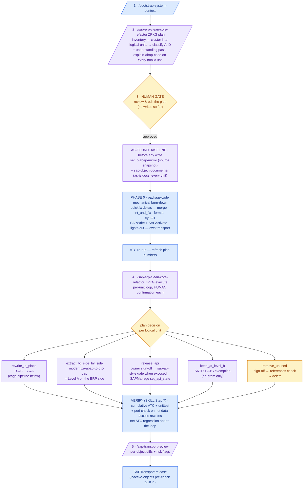
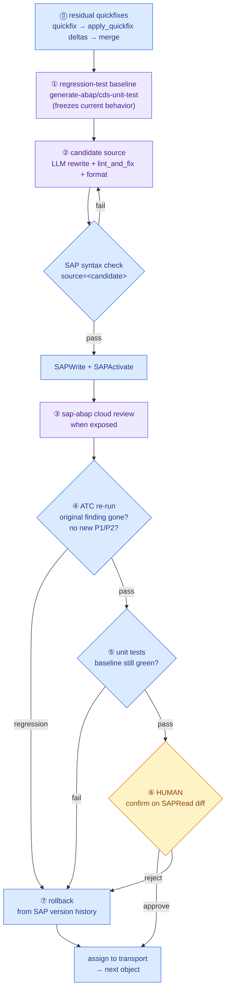

# Clean Core Refactor — Operator's Guide

The end-to-end sequence for taking one custom package (`Z*`/`Y*`) from "unknown custom code"
to "classified, remediated, and refactored toward Clean Core Level B/A" — showing **exactly
which skill runs at each step, where it comes from, what it delegates to, and how automated
each step really is**.

You type **four operational commands** plus one human review gate. Table A counts the gate as step 3, so it shows five process steps.

## Legend 1 — where does each piece come from?

| Origin | Meaning |
|---|---|
| **CHAIN** | Ships with this skill set (`sap-erp-clean-core-refactor` + the `modernize-abap-cap-*` chain) |
| **arc-1** | Stock ARC-1 skill — present in the upstream `skills/` catalog |
| **PLUGIN** | External agent plugin/skill (e.g. [secondsky/sap-skills](https://github.com/secondsky/sap-skills)) — review/gate commands only, never writes. Use only when installed/exposed; otherwise run the documented fallback/manual gate and record degradation. Do not copy GPL plugin text into ARC-1 docs |
| **MCP** | An MCP server, not a skill. **ARC-1 is the only thing that ever writes to the SAP system** |

Division of labor: **skills decide, plugins review, ARC-1 executes.**

## Legend 2 — automation tiers: who actually produces the result?

There is no "refactor this to clean core" API in SAP ADT. ARC-1 reads, writes, activates and
checks — **the new ABAP code is written by the LLM agent running this skill**, inside a cage of
deterministic gates. Every step below is tagged with one of three tiers:

| Tier | What it means | Who decides the output | Reliability model |
|---|---|---|---|
| **Deterministic** 🟦 | SAP-proposed quickfixes (`SAPDiagnose quickfix → apply_quickfix` returns deltas), `SAPLint lint_and_fix`/`format` returns candidate source, ATC/unit-test runs, reads, transport ops | SAP / abaplint / the tool — zero LLM creativity; `SAPWrite` is still the persistence step | High: exact transformations and hard pass/fail gates |
| **Generative** 🟪 | The actual rewrites (D→B, C→A), test generation, CAP scaffolds, reviews, reports — the agent reads the source, consults [`PATTERNS.md`](./PATTERNS.md) recipes + plugin knowledge, and writes the result | The LLM agent | Only as good as the gates around it — never trusted bare (see the cage below) |
| **Human** 🟨 | Plan review/edit, per-unit confirmation on the diff, `remove_unused` sign-off, side-by-side QA parity | You | — |

The mechanical (Deterministic) pass runs **twice by design**: once package-wide as **Phase 0**
right after plan approval (lights-out — the only part that needs no per-object review), and
again per unit as step ⓪ of every rewrite, catching mechanical findings that surface during
the rewrite itself.

## The process at a glance

🟦 Deterministic · 🟪 Generative · 🟨 Human (mixed-tier nodes carry their dominant tier) — numbers 1–5 refer to table A; VERIFY is SKILL.md Step 7. The baseline, Phase 0 and the per-unit loop are all phases OF command 4 (`execute`).

**The cage around every Generative rewrite** (one logical unit inside `rewrite_in_place`):

## Prerequisites (server-side, once)

| Config | Why |
|---|---|
| `SAP_ALLOW_WRITES=true` + `SAP_ALLOWED_PACKAGES=ZPKG/**` | every mutation (incl. activation) is checked fail-closed against the object's real package |
| `SAP_ALLOW_TRANSPORT_WRITES=true` | create/release transports in Step 6.5 (during `execute`); `reassign` is owner transfer only |
| `SAP_ALLOW_FREE_SQL=true` *(optional)* | only for runtime dead-code detection (SCMON/SUSG) |
| **Transportable package — not `$TMP`** | ATC silently skips local objects: 0 findings on a `$TMP` package means "not checked", not "clean" |

> **Honesty note on "automatic ATC remediation":** the automatic pass covers *mechanical*
> findings (Deterministic tier — Phase 0 plus the per-object residue step). Architectural
> findings — unreleased APIs, direct DB access, modifications — have no auto-fix by
> definition; they become plan decisions executed at the Generative tier under the cage above.

## A — What you type (5 steps)

| # | You type | Skill | Origin | Tier | What happens |
|---|---|---|---|---|---|
| 1 | `/bootstrap-system-context` | `bootstrap-system-context` | **arc-1** | Deterministic | `SAPRead(type="SYSTEM")`, `SAPRead(type="COMPONENTS")`, `SAPManage(action="probe")`, `SAPLint(action="list_rules")` → SID, release, components, features, formatter + ATC/lint preset; optional `abap_feature_matrix` snapshot → `system-info.md`. No sub-skills |
| 2 | `/sap-erp-clean-core-refactor ZPKG plan` | `sap-erp-clean-core-refactor` | **CHAIN** | Generative (analysis — **no writes**) over Deterministic evidence | Inventory → classification → per-unit decision → editable plan at `docs/refactor/<date>-clean-core-plan.md`, with person-day totals per [PATTERNS §9.5](./PATTERNS.md). Delegation: table B. *Optional cheaper pre-step*: `ZPKG estimate` — same read-only pipeline, no decisions, emits the effort sizing report alone |
| 3 | *(review & edit the plan — no command)* | — | — | **Human** | The gate. Override any per-unit decision before anything touches the system |
| 4 | `/sap-erp-clean-core-refactor ZPKG execute` | `sap-erp-clean-core-refactor` | **CHAIN** | **Phase 0**: Deterministic, lights-out · then per-unit loop: mixed tiers (table C) with **Human** confirmation throughout | Package-wide mechanical burn-down + ATC refresh first, then applies the plan unit by unit. Delegation: table C |
| 5 | `/sap-transport-review` | `sap-transport-review` | **arc-1** | Generative review over Deterministic diffs | Pre-release gate: per-object unified diffs + risk flags on the transport. Standalone |

## B — Delegation chain of `plan` (step 2)

| Internal step | Calls | Origin | Tier |
|---|---|---|---|
| 1e Bootstrap (if step 1 wasn't run) | `bootstrap-system-context` | **arc-1** | Deterministic |
| 1f Transport-conflict scan | `sap-transport-overview` — objects locked in someone else's open TR would stall Step 6.5 (transport handling inside `execute`) | **arc-1** | Deterministic |
| 2 Inventory | `SAPRead(type="DEVC")` recursive, `SAPSearch(searchType="tadir_lookup", names=["<object_name>"])` for exact-name validation, red-flag `grep` pre-scan | **MCP** ARC-1 | Deterministic |
| 2d Dead code (optional) | `sap-unused-code` — needs `SAP_ALLOW_FREE_SQL` | **arc-1** | Deterministic (SCMON/SUSG evidence) |
| 2e Cluster into logical units | Type-specific resolvers: PROG real `INCLUDE` statements via `SAPRead(type="PROG", name="<program>")` / `SAPRead(type="INCL", name="<include>")`, FUGR via `SAPRead(type="FUGR", expand_includes=true)`, CLAS as one ADT unit, RAP/CDS siblings from `SAPContext(action="impact", type="DDLS")`, SEGW through MPC/DPC/service evidence. Shared includes use `SAPNavigate(action="references")`. Classification, decisions and plan rows are per unit, never per bare include | **MCP** ARC-1 | Deterministic (structure data); unit boundaries are mechanical rules |
| 2f Impact / fan-in (per unit) | DDLS: `SAPContext(action="impact", type="DDLS")`; non-CDS: `SAPNavigate(action="references")`; cached `SAPContext(action="usages")` only when warmup is enabled. Fan-in drives the risk × effort multipliers | **MCP** ARC-1 | Deterministic (data); multiplier table is mechanical |
| 3 Classification A–D | `sap-clean-core-atc` → `SAPDiagnose(action="atc", type="<type>", name="<name>")` per object + `sap_get_object_details` per SAP reference; worst-level roll-up | **arc-1** + **MCP** sap-docs | Deterministic (ATC findings + dataset lookup + mechanical roll-up) |
| 4-0 Understanding pass — **every non-A unit, systematic** | `explain-abap-code` → `docs/refactor/analysis/<unit>.md` (purpose, flow, deps); feeds the decision and the execute-phase rewrite context | **arc-1** | Generative (analysis) over Deterministic reads |
| 4 JIT evidence lookup | SAP docs MCP (`sap_get_object_details`, `sap_search_objects`, unified `search` + `fetch` when exposed, `sap_discovery_center_service` for known services, Discovery Center search only when exposed, `abap_feature_matrix`, `ui5_version_diff` when exposed), `@sap/cds-mcp`, `context7` | **MCP** | Deterministic retrieval, Generative synthesis. Dedicated `sap_community_search` is optional; if absent, use unified `search(includeOnline=true)` for community/blog evidence |
| 4 Per-object decision | decision tree + [`PATTERNS.md`](./PATTERNS.md) Category 9 recipes | **CHAIN** (reference doc) | Generative (proposal — finalized by the **Human** gate, step 3 of table A) |
| 5 Stakeholder report (`--report=dossier`) | `sap-migration-dossier` | **arc-1** | Generative (report writing) |

## C — Delegation chain of `execute` (step 4)

**Phase 0 comes first, package-wide, then the per-object loop.**

| Plan decision | Calls | Origin | Tier |
|---|---|---|---|
| **As-found baseline** (before ANY write, quickfixes included) | `setup-abap-mirror` (source snapshot) + `sap-object-documenter` batch over every plan unit → `docs/refactor/baseline/<date>/` (the "before" picture; regenerate after verification for the "after") | **arc-1** | Deterministic reads + Generative (docs writing) — read-only, lights-out |
| **Phase 0 — mechanical burn-down** (all rewrite/mechanical objects, one sweep) | Per object: `SAPRead(type="<type>", name="<name>")` source → `SAPDiagnose(action="quickfix", type="<type>", name="<name>", source="<source>", line=<line>, column=<column>)` at ATC finding lines → choose matching proposal → `SAPDiagnose(action="apply_quickfix", type="<type>", name="<name>", source="<source>", line=<line>, column=<column>, proposalUri="<proposal_uri>", proposalUserContent="<proposal_user_content>")` deltas → merge → `SAPLint(action="lint_and_fix", source="<candidate>", name="<name>")` → `SAPLint(action="format", source="<candidate>")` → `SAPDiagnose(action="syntax", type="<type>", name="<name>", source="<candidate>")` → `SAPWrite(action="update", type="<type>", name="<name>", source="<candidate>", transport="<tr>")` → `SAPActivate(type="<type>", name="<name>")`; own transport; ATC re-run refreshes plan numbers | **MCP** ARC-1 | **Deterministic — lights-out** (no per-unit review; transport diff review still required) |
| **`rewrite_in_place`** (D→B, C→A) | ⓪ residual quickfixes surfaced during rewrite: `quickfix` → `apply_quickfix` deltas → merge into candidate source | **MCP** ARC-1 | Deterministic |
| | ① regression tests: `generate-abap-unit-test` / `generate-cds-unit-test` (CDS seeds from `SAPDiagnose(action="cds_testcases", name="<cds_name>")` on 8.16+) | **arc-1** | Generative (test code) over Deterministic seeds |
| | ② rewrite per [`PATTERNS.md`](./PATTERNS.md) 9.1/9.2 recipes → `SAPLint(action="lint_and_fix", source="<candidate>", name="<name>")` → `SAPLint(action="format", source="<candidate>")` → `SAPDiagnose(action="syntax", type="<type>", name="<name>", source="<candidate>")` → `SAPWrite(action="update", type="<type>", name="<name>", source="<candidate>", transport="<tr>")` → `SAPActivate(type="<type>", name="<name>")` | **CHAIN** + **MCP** ARC-1 | **Generative** — the LLM writes the ABAP; lint, format and syntax are Deterministic pre-write gates |
| | ③ `sap-abap` cloud review when the plugin exposes it — cheap review BEFORE the ATC round-trip | **PLUGIN** `sap-abap` | Generative (review) |
| | ④⑤⑥ `SAPDiagnose(action="atc", type="<type>", name="<name>")` + `SAPDiagnose(action="unittest", type="<type>", name="<name>")` + `SAPRead(type="<type>", name="<name>", action="diff")`; ⑦ rollback from version history (`SAPRead(type="VERSIONS", name="<name>", objectType="<type>")` → `SAPRead(type="VERSION_SOURCE", versionUri="<revision_uri>")` → `SAPWrite(action="update", type="<type>", name="<name>", source="<revision_source>", transport="<tr>")`) on regression | **MCP** ARC-1 | Deterministic gates + **Human** confirmation on the diff |
| | RAP behavior logic → [`generate-rap-logic`](../generate-rap-logic/SKILL.md); full RAP stack (rare) → [`generate-rap-service-researched`](../generate-rap-service-researched/SKILL.md) | **arc-1** | Generative |
| **`rewrite_in_place`** — specialized shapes | SEGW V2 service (MPC/DPC) → `migrate-segw-to-rap` (never hand-rewrite generated classes) | **arc-1** | Generative (guided reverse-engineering) |
| | analytical Z report → `generate-analytics-star-schema` → `generate-cds-analytical-query` | **arc-1** | Generative |
| | only mechanical findings on the object → `migrate-custom-code` standalone | **arc-1** | Deterministic core + Generative residue |
| **`extract_to_side_by_side`** (= Level A on the ERP side) | `modernize-abap-to-btp-cap` orchestrator, which chains: | **CHAIN** | Generative scaffold, Deterministic compile/validate gates |
| | ├ `modernize-abap-cap-schema` (`db/schema.cds` from Z tables) | **CHAIN** | Generative (mapping table-driven) + Deterministic `cds compile` gate |
| | ├ `modernize-abap-cap-service` (`srv/service.cds` + handler stubs) | **CHAIN** | Generative |
| | ├ `sap-api-style` review on the generated service surface when exposed; otherwise equivalent manual checklist | **PLUGIN** `sap-api-style` | Generative (review) |
| | ├ UI: `convert-ui5-to-fiori-elements` (annotation-driven LROP) **or** `modernize-ui5-app` (freestyle TS) | **arc-1** | Generative |
| | ├ Fiori app-development + Fiori tools gate (CAP vs standalone, metadata ownership, FE tooling when exposed) | **PLUGIN/skill** `sap-fiori-app-development`, `sap-fiori-tools`, `sap-fiori-create-cli` | Generative review + tool-driven scaffold when exposed |
| | ├ UI quality/design gates: `sapui5-linter`, `sapui5-cli`, `sap-fiori-eslint-plugin` when exposed or local `@ui5/linter` fallback; `sap-fiori-guidelines` for UX/accessibility/design; visual-filter/chart skills only when that UX is in scope | **PLUGIN/skill** `sapui5-linter`, `sapui5-cli`, `sap-fiori-eslint-plugin`, `sap-fiori-guidelines`, `sap-fiori-add-visual-filter`, `sap-fiori-analytical-chart` | Deterministic lint + Generative review |
| | ├ hand-off gates: CAP readiness + BTP readiness; `sap-btp-best-practices` is SHOULD for every BTP deployable extension and branch-MUST for production/high-risk landscapes | **PLUGIN** `sap-cap-capire`, `sap-btp-developer-guide`, `sap-btp-best-practices` | Generative (review) |
| | ├ service lifecycle gate when the deliverable creates/binds BTP services | **PLUGIN** `sap-btp-service-manager` | Generative review + deterministic CLI/script checks when available |
| | ├ destination triage when exposed; otherwise manual destination / Cloud Connector / auth checks | **PLUGIN** `sap-btp-connectivity` | Generative (diagnosis) |
| | ├ situational branches: HANA/SQLScript, Datasphere/SAC, AI | **PLUGIN** `sap-sqlscript`, `sap-hana-*`, `sap-datasphere`, `sap-sac-*`, `sap-ai-*`, `sap-cloud-sdk-ai` | Branch-MUST only when those targets/artifacts are in scope |
| | QA parity before the ABAP original is retired | — | **Human** |
| **`release_api`** (B→A closing move) | `SAPRead(type="API_STATE", name="<dep>", objectType="<type>")` → type-aware fan-in stability check (`SAPContext(action="impact", type="DDLS")` for DDLS, `SAPNavigate(action="references")` for non-CDS) + owner sign-off → `sap-api-style` review when available → `SAPManage(action="set_api_state", name="<dep>", objectType="<type>", contract="C1", transport="<tr>")` | **PLUGIN** + **MCP** ARC-1 | **Human** sign-off → Generative review → Deterministic PUT |
| **`keep_at_level_b`** (on-prem only) | `sap-object-documenter` — SKTD rationale + ATC exemption | **arc-1** | Generative (documentation) |
| **`remove_unused`** | sign-off → `SAPNavigate(action="references", type="<type>", name="<name>")` last check → `SAPWrite(action="delete", type="<type>", name="<name>", transport="<tr>")` | **MCP** ARC-1 | **Human** sign-off → Deterministic check + delete |
| Transport handling (per phase/cluster) | `SAPTransport(action="check", type="<type>", name="<name>", package="<package>")` → `SAPTransport(action="create", description="<description>", package="<package>")`; writes pass `transport="<tr>"`; `SAPTransport(action="reassign", id="<tr>", owner="<user>")` only for owner transfer; after transport review use `SAPTransport(action="release_recursive", id="<tr>")`. ARC-1 pre-checks inactive objects before release | **MCP** ARC-1 | Deterministic |

## D — Verification (inside step 4, then step 5)

| Check | Calls | Origin | Tier |
|---|---|---|---|
| Cumulative ATC + unit tests on changed objects (package roll-up via `sap-clean-core-atc`; net ATC regression **aborts the loop**) | `SAPDiagnose(action="atc", type="<type>", name="<name>")` + `SAPDiagnose(action="unittest", type="<type>", name="<name>")` | **MCP** ARC-1 | Deterministic |
| Perf regression on hot data-access rewrites (a released `I_*` view can be slower than the SELECT it replaced) | `debug-slow-sql` ladder (`odata_perf` / `cds_sql`) | **arc-1** | Deterministic measurements, Generative interpretation |
| Pre-release transport gate | `sap-transport-review` (step 5 of table A) | **arc-1** | Generative review over Deterministic diffs |
| Session learnings (optional) | [`analyze-chat-session`](../analyze-chat-session/SKILL.md) | **arc-1** | Generative |

## The full census

- **You type 4 operational commands** (2 stock arc-1 + 2 this chain's orchestrator) plus 1 human review gate, shown as step 3 in table A.
- **This chain owns exactly 4 skills**: the orchestrator + the 3 CAP-extraction skills. Everything else it drives is stock arc-1 (**21 upstream skills** engaged across the run: bootstrap-system-context, sap-transport-overview, sap-unused-code, sap-clean-core-atc, explain-abap-code, sap-migration-dossier, setup-abap-mirror, generate-abap-unit-test, generate-cds-unit-test, generate-rap-logic, generate-rap-service-researched, migrate-segw-to-rap, generate-analytics-star-schema, generate-cds-analytical-query, migrate-custom-code, convert-ui5-to-fiori-elements, modernize-ui5-app, sap-object-documenter, debug-slow-sql, sap-transport-review, analyze-chat-session) or external SAP capabilities. External plugins never write to SAP; baseline gates cover ABAP/CAP/BTP/Fiori/UI5, and service-manager, HANA/SQLScript, Datasphere/SAC, and AI skills become branch-MUST only when their target is selected.
- **Every write to the SAP system goes through the ARC-1 MCP server** — behind its safety ceiling (`allowWrites`, package allowlist, transport gates), regardless of which skill asked for it.
- **Automation in one sentence**: Deterministic evidence and gates at the edges, Generative code in the middle, Human confirmation on every diff that reaches the system — only Phase 0 (and the per-object mechanical residue) runs lights-out.

## See also

- [`SKILL.md`](./SKILL.md) — the protocol this guide is the operator view of
- [`DECISION_MATRIX.md`](./DECISION_MATRIX.md) — canonical source-level → target-level action matrix
- [`chain.json`](./chain.json) — machine-readable chain manifest validated by `npm run check:clean-core-skills`
- [`INTEGRATIONS.md`](./INTEGRATIONS.md) — the same mapping at sub-step granularity (tool × skill × plugin per step)
- [`PATTERNS.md`](./PATTERNS.md) — Category 9: the per-finding escalation recipes used during rewrites
- [`SOURCES.md`](./SOURCES.md) — where the evidence for every decision comes from
