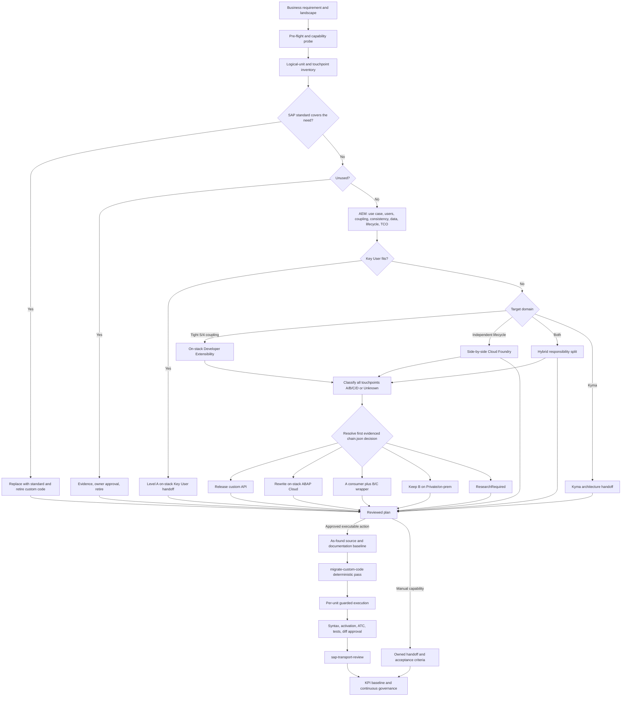
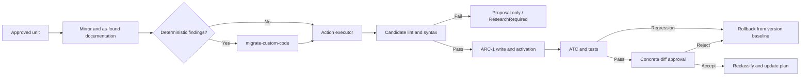
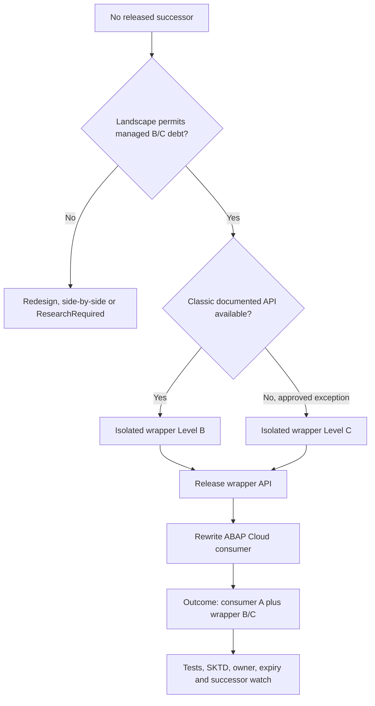

# Clean Core Refactor Workflow

This is the operator view of [`SKILL.md`](./SKILL.md). Decisions are defined in
[`DECISION_MATRIX.md`](./DECISION_MATRIX.md), machine routing in [`chain.json`](./chain.json), and
validated ARC-1 payloads in [`action-catalog.json`](./action-catalog.json). Start with
[`README.md`](./README.md) when onboarding.

## End-to-end flow

## Five operator movements

| Movement | Command | Main outputs | Writes |
|---|---|---|---|
| Understand | `sap-erp-clean-core-refactor ZPKG discover` | system context, capabilities, inventory, touchpoints | No |
| Size | `sap-erp-clean-core-refactor ZPKG estimate` | clusters, current levels, effort range, evidence gaps | No |
| Decide | `sap-erp-clean-core-refactor ZPKG plan` | AEM records, decision rows, operation IDs, approvals | No |
| Execute | `sap-erp-clean-core-refactor ZPKG execute` | accepted changes, validation evidence, handoffs | Yes, approved branches only |
| Govern | `sap-erp-clean-core-refactor ZPKG govern` | KPIs, regression, wrapper/exemption lifecycle | No by default |

The human plan gate sits between Decide and Execute. No write-capable delegate may run before it.

## Plan sequence

1. `bootstrap-system-context` captures release, system type, components and ADT capabilities.
2. `sap-transport-overview` identifies open-request conflicts.
3. ARC-1 inventory operations collect package contents and exact object metadata.
4. The orchestrator clusters compilation/logical units and maps extension touchpoints.
5. `sap-unused-code` supplies removal evidence where SQL/runtime data is available.
6. `sap-clean-core-atc` classifies current evidence without treating unknown as D.
7. `explain-abap-code` documents intent for every non-trivial non-A unit.
8. The local curated knowledge index supplies bounded rules and page provenance.
9. Live SAP release state and official documentation confirm the specific successor or extension
   point.
10. The decision matrix selects a target domain and action. The output is editable and read-only.

## Execution sequence

Deterministic SAP quick fixes may reuse one explicit approval scoped to package and transport. They
still pass syntax, activation, ATC and tests. Mechanical transformations without an SAP proposal,
and every generated redesign, require concrete diff approval.

## Action routing

| Action | Primary executor | Important boundary |
|---|---|---|
| `replace_with_standard` | Human/SAP configuration plus ARC-1 retirement | Parity approval before deletion |
| `replace_with_key_user_extensibility` | Key User owner, manual SAP app handoff | ARC-1 provides evidence; it does not automate key-user apps |
| `rewrite_on_stack_abap_cloud` | ARC-1 plus ABAP/RAP skills | Level A can remain embedded in S/4HANA |
| `release_api` | ARC-1 | Use the live supported contract, then reclassify consumers |
| `create_or_use_wrapper` | ARC-1 plus human exception governance | Wrapper package/component is separate; report composite level |
| `extract_to_side_by_side_cf` | CAP/Fiori skills; ARC-1 manages ERP boundary | Old ERP code retires only after parity |
| `plan_kyma_side_by_side` | Architecture handoff | No current Kyma executor in the CAP skill |
| `hybrid_extension` | Composite on-stack and CF executors | Record responsibility and transaction boundaries |
| `keep_at_level_b` | Documentation/governance | Private/on-prem only; Level B needs no informational ATC exemption |
| `remove_unused` | ARC-1 after evidence and owner approval | Final references check immediately before delete |
| `research_required` | Read-only research | Never converted to D without evidence |

## Wrapper workflow

Never place the wrapper in the ABAP Cloud software component. Do not wrap SAP GUI technology,
uncontrolled commits/rollbacks or an API whose semantics cannot be stabilized.

## Governance loop

| Control | Frequency | Output |
|---|---|---|
| ATC assessment | Per plan and after every unit | current classification and regression delta |
| Development/transport ATC gate | Every changed transport | blocking P1/P2 findings under governed variant |
| Wrapper successor watch | Every SAP upgrade/release review | replace/retain decision and retirement date |
| Exception expiry | Monthly or release cycle | renew, remediate or close |
| Unused-code refresh | Quarterly | removal candidates and Unused Code Share |
| KPI review | Release or quarterly | Clean Core Share, Technical Debt Score, Unused Code Share, Business Modifications |

## Acceptance checklist

- The plan records business need, landscape, target domain and source evidence.
- The selected action exists in `chain.json` and all operation IDs exist in `action-catalog.json`.
- Manual Key User/Kyma branches contain owner, implementation app/tool and acceptance criteria.
- Every write is inside ARC-1 package, transport and authorization gates.
- Every generated diff has explicit approval.
- Every changed unit has syntax, activation, ATC and applicable test evidence.
- Composite wrapper debt and retirement triggers remain visible in governance output.
- `sap-transport-review` passes before release.
